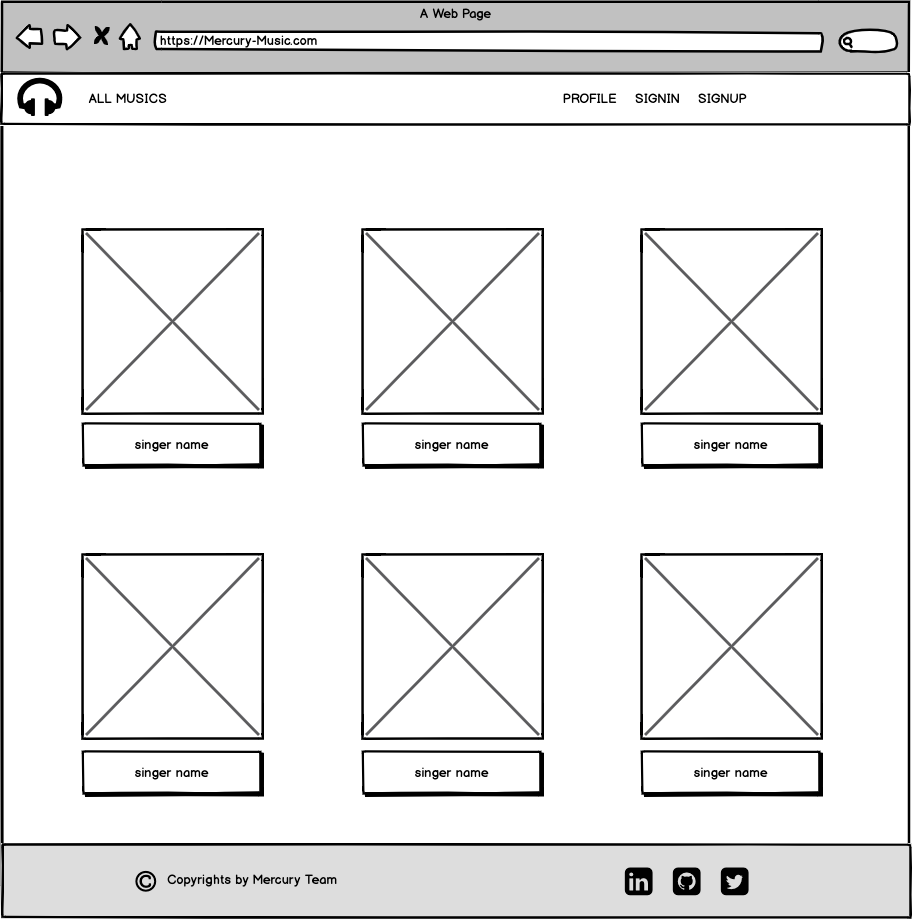

# Project-3 music App
 # How to visit our app
open this link on your browser:
 # Project Overview
Music player and server for  Shows audio files stored 
categorized by artists and albums. and depending on the browser, many other audio formats too. Supports shuffle play and playlists. 

 # Prototype

 # Software Technologies
-React
-API
-Bootstrap
-MongoDB 
-Nodejs

 # User requirements
- User can be able to sign up 
- User can be able to sign in
- User can be able to change password be email
- User can be able to sign out
- User can be able  to search for specific music 
- User can be able to add music for favorite page

#Future work
- Allow users to build own playlists.
- More content classification 

